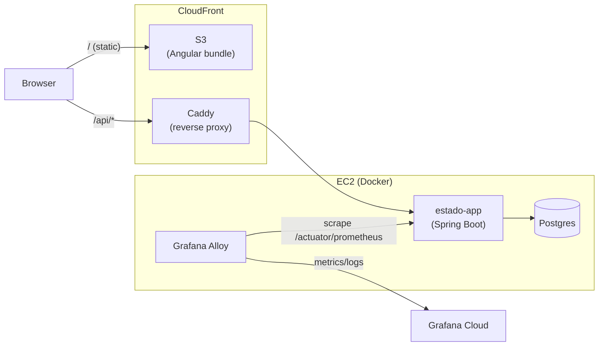

# cliente-estado

🇧🇷 [Ler em português](README.pt-BR.md)

[](https://github.com/ronybrand/angular_estado/actions/workflows/ci.yml)
[](https://github.com/ronybrand/angular_estado/actions/workflows/codeql.yml)
[](https://codecov.io/gh/ronybrand/angular_estado)

🔗 **[Live application](https://d3bqbg07tehy1h.cloudfront.net/)**

Angular frontend for the [Estado project](https://github.com/ronybrand/estado) — CRUD for Brazilian federative units (states). Consumes the Spring Boot backend API at `/api/*`.

Originally generated with [Angular CLI](https://github.com/angular/angular-cli); now on Angular 22 (see `package.json`).

## Architecture



Frontend (S3/CloudFront, static) and backend (a single EC2 instance running
the app, Postgres and Grafana Alloy as Docker containers) are published from
separate repositories and pipelines — see the [Deploy](#deploy) section below
and `docs/adr/` in the [`estado`](https://github.com/ronybrand/estado) repo
for the decision history.

## Stack

- [Angular 22](https://angular.dev/) (standalone, signals) + Bootstrap 5
- [Vitest](https://vitest.dev/) (unit) + [Playwright](https://playwright.dev/) (e2e, chromium/firefox)
- ESLint + Prettier + Husky/lint-staged
- GitHub Actions (CI + deploy) + AWS S3/CloudFront

## Project structure

```
src/app/
├── paginas/          # Route components (lista-estado, criar-estado, editar-estado)
├── compartilhado/     # Components and helpers shared across pages
│   ├── form-estado/    # Form shared by create/edit
│   ├── error-msg/       # Error display (role="alert")
│   ├── spinner/          # Loading indicator (role="status")
│   ├── icon/              # app-icon — centralized SVG icons (see icon-paths.ts)
│   └── erro/               # extraiMensagemErro, extraiRequestIdErro, subscreveComProcessando
├── services/          # Thin wrappers over HttpClient (EstadoService, InfoService)
├── interceptors/      # HttpInterceptorFn (request-id, timeout-retry)
├── interfaces/         # Types (Estado, BackendInfo, FrontendVersion)
└── app.routes.ts       # Routes with lazy loading (loadComponent)
```

Folder and domain-component names are in Portuguese (`paginas`, `estado`),
consistent with the [backend](https://github.com/ronybrand/estado)'s domain.

### Code conventions

- Standalone components, no `NgModule`; `inject()` instead of constructor
  injection.
- Local state with Signals (`signal`/`computed`); lazy routes use `input()`
  bound to the route parameter via `withComponentInputBinding()` (see
  `editar-estado.component.ts`) instead of `ActivatedRoute.snapshot`.
- New Angular APIs: `input()`/`output()`/`viewChild.required()` and
  `@if`/`@for` control flow — no decorators (`@Input`/`@Output`/`@ViewChild`)
  and no `*ngIf`/`*ngFor` anywhere in the codebase.
- `subscreveComProcessando` (`compartilhado/erro/`) centralizes the "loading
  signal + subscribe + error handling via `ErrorMsgComponent`" pattern,
  reused across all 3 pages — the most reused state abstraction in the
  project.
- Each page injects its own `ErrorMsgComponent` via `viewChild.required` —
  there's no global error-notification service; errors are always local to
  the page where they occurred.

## Prerequisites

Requires the [Estado project](https://github.com/ronybrand/estado) backend running locally at `http://localhost:8090` — without it, `npm start` still serves the UI, but calls to `/api/*` fail.

## Development server

To start a local development server, run:

```bash
npm start
```

This runs `ng serve --proxy-config proxy.config.js`, proxying `/api` to the local backend at `http://localhost:8090` (see `proxy.config.js`). Open `http://localhost:4200/` — the app reloads automatically whenever you change a source file.

## Building

To build the project run:

```bash
npm run build
```

Compiles and writes the build artifacts to `dist/cliente-estado/browser/`. Uses the `production` configuration by default (optimized, with `outputHashing` on file names).

## Lint and formatting

```bash
npm run lint          # eslint (angular-eslint + typescript-eslint)
npm run format:check  # prettier --check
npm run format        # prettier --write
```

Husky + lint-staged automatically run `eslint --fix` and `prettier --write` on pre-commit.

## Running unit tests

To execute unit tests with the [Vitest](https://vitest.dev/) test runner, use the following command:

```bash
npm test
```

15 spec files covering components, services and interceptors.

## Running end-to-end tests

End-to-end tests with [Playwright](https://playwright.dev/) (chromium and firefox), covering the list/create/edit/delete state flows:

```bash
npm run e2e
```

## Design decisions

The visual identity (`feature/design-visual`) customizes Bootstrap 5 via CSS
variables (a custom palette, Inter + Space Grotesk typography, inline icons)
instead of migrating to Tailwind or another framework — less effort, zero
risk of breaking the build, and keeps the project's focus on the backend.
See [`src/styles.scss`](src/styles.scss).

## CI/CD

`.github/workflows/ci.yml` runs lint, unit tests, build and e2e on every push/PR to `master`. See the [Deploy](#deploy) section below for the publishing pipeline.

## Deploy

The production build is published to S3 + CloudFront (see ADR 0013 in the
`estado` backend repo, `docs/adr/0013-frontend-s3-cloudfront.md`). The
`.github/workflows/deploy.yml` workflow builds and syncs automatically on
every push to `master` (after CI passes), authenticating to AWS via OIDC —
no static access key.

Required repository variables (Settings → Secrets and variables → Actions →
Variables), obtained from the backend's Terraform outputs
(`terraform output` in `estado/terraform`):

- `AWS_DEPLOY_ROLE_ARN` — `frontend_deploy_role_arn`
- `AWS_FRONTEND_BUCKET` — `frontend_bucket`
- `AWS_CLOUDFRONT_DISTRIBUTION_ID` — `frontend_cloudfront_distribution_id`

The API is accessed at `/api/*` under the same CloudFront domain (which
forwards to the EC2/Caddy backend) — that's why `environment.prod.ts` uses a
relative `apiUrl: '/api'`, with no real cross-origin CORS.

The app's footer shows the frontend's build commit and date
(`public/version.json`, generated in `deploy.yml`) and the published
backend's build commit and date (`/actuator/info`, via `InfoService`) —
letting you quickly check whether what's live matches the latest push.
