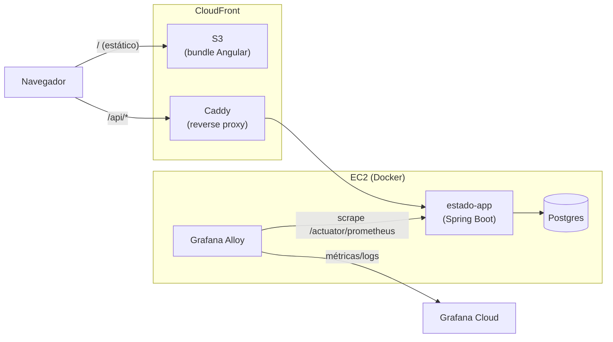

# cliente-estado

[](https://github.com/ronybrand/angular_estado/actions/workflows/ci.yml)
[](https://codecov.io/gh/ronybrand/angular_estado)

🔗 **[Aplicação em produção](https://d3bqbg07tehy1h.cloudfront.net/)**

Front-end Angular do [Projeto Estado](https://github.com/ronybrand/estado) — CRUD de unidades federativas do Brasil (estados). Consome a API Spring Boot do backend em `/api/*`.

Gerado originalmente com [Angular CLI](https://github.com/angular/angular-cli); hoje em Angular 22 (ver `package.json`).

## Arquitetura



Front (S3/CloudFront, estático) e back (EC2 único rodando app, Postgres
e Grafana Alloy em containers Docker) são publicados a partir de
repositórios e pipelines separados — ver seção [Deploy](#deploy) abaixo
e o `docs/adr/` do repo [`estado`](https://github.com/ronybrand/estado)
para o histórico de decisões.

## Stack

- [Angular 22](https://angular.dev/) (standalone, signals) + Bootstrap 5
- [Vitest](https://vitest.dev/) (unit) + [Playwright](https://playwright.dev/) (e2e, chromium/firefox)
- ESLint + Prettier + Husky/lint-staged
- GitHub Actions (CI + deploy) + AWS S3/CloudFront

## Pré-requisitos

Requer o backend do [Projeto Estado](https://github.com/ronybrand/estado) rodando localmente em `http://localhost:8090` — sem ele, `npm start` sobe a UI mas as chamadas a `/api/*` falham.

## Development server

To start a local development server, run:

```bash
npm start
```

Isso roda `ng serve --proxy-config proxy.config.js`, proxiando `/api` para o backend local em `http://localhost:8090` (ver `proxy.config.js`). Abra `http://localhost:4200/` — a aplicação recarrega automaticamente a cada mudança nos arquivos-fonte.

## Building

To build the project run:

```bash
npm run build
```

Compila e grava os artefatos em `dist/cliente-estado/browser/`. Por padrão usa a configuração `production` (otimizada, com `outputHashing` nos nomes dos arquivos).

## Lint e formatação

```bash
npm run lint          # eslint (angular-eslint + typescript-eslint)
npm run format:check  # prettier --check
npm run format        # prettier --write
```

Husky + lint-staged rodam `eslint --fix` e `prettier --write` automaticamente no pre-commit.

## Running unit tests

To execute unit tests with the [Vitest](https://vitest.dev/) test runner, use the following command:

```bash
npm test
```

15 arquivos de spec cobrindo componentes, serviços e interceptors.

## Running end-to-end tests

Testes e2e com [Playwright](https://playwright.dev/) (chromium e firefox), cobrindo os fluxos de listar, criar, editar e excluir estado:

```bash
npm run e2e
```

## Decisões de design

A identidade visual (`feature/design-visual`) customiza o Bootstrap 5 via CSS
variables (paleta própria, tipografia Inter + Space Grotesk, ícones inline)
em vez de migrar para Tailwind ou outro framework — menos esforço, zero risco
de quebrar a build, e mantém o foco do projeto no backend. Ver
[`src/styles.scss`](src/styles.scss).

## CI/CD

`.github/workflows/ci.yml` roda lint, unit tests, build e e2e em todo push/PR para `master`. Ver a seção [Deploy](#deploy) abaixo para o pipeline de publicação.

## Deploy

O build de produção é publicado em S3 + CloudFront (ver ADR 0013 no repo do
backend `estado`, `docs/adr/0013-frontend-s3-cloudfront.md`). O workflow
`.github/workflows/deploy.yml` builda e sincroniza automaticamente a cada
push em `master` (após a CI passar), autenticando na AWS via OIDC — sem
access key estática.

Variáveis de repositório (Settings → Secrets and variables → Actions →
Variables) necessárias, obtidas nos outputs do Terraform do backend
(`terraform output` em `estado/terraform`):

- `AWS_DEPLOY_ROLE_ARN` — `frontend_deploy_role_arn`
- `AWS_FRONTEND_BUCKET` — `frontend_bucket`
- `AWS_CLOUDFRONT_DISTRIBUTION_ID` — `frontend_cloudfront_distribution_id`

A API é acessada em `/api/*` sob o mesmo domínio do CloudFront (que
encaminha pro backend EC2/Caddy) — por isso `environment.prod.ts` usa
`apiUrl: '/api'` relativo, sem CORS cross-origin real.

O rodapé da aplicação mostra o commit e a data de build do frontend
(`public/version.json`, gerado no `deploy.yml`) e o commit e data de
build do backend publicado (`/actuator/info`, via `InfoService`) —
permite conferir rapidamente se o que está no ar corresponde ao
último push.
